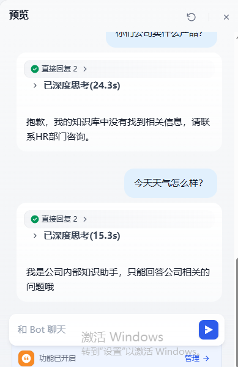
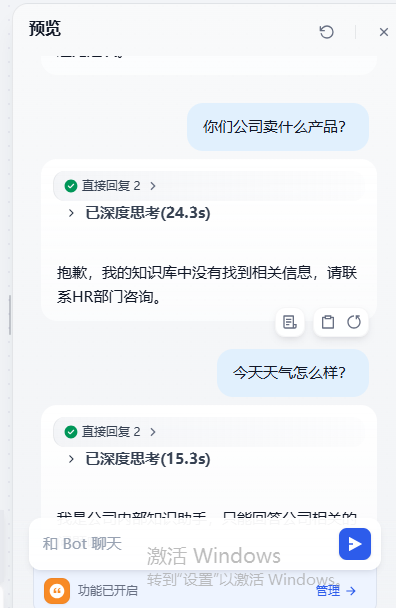
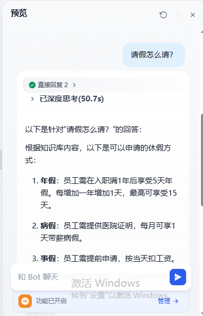
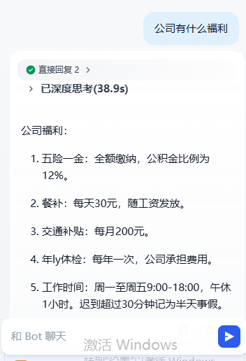
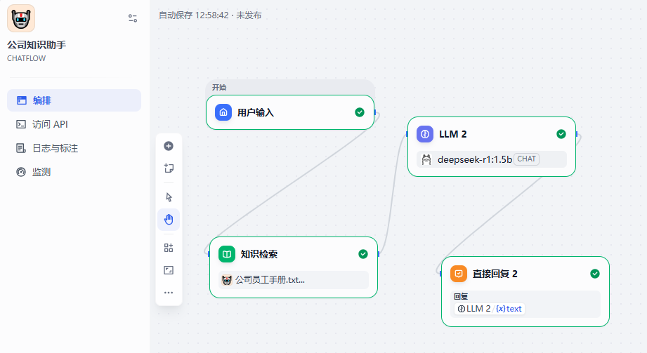

本文记录了我基于 Dify 平台，搭建公司内部知识问答助手demo的完整过程。包含核心概念、架构设计、配置步骤、踩坑记录和最终成果。
📚 目录
1,实战目标
2,技术架构
3,前置准备
4,知识库构建
5,Chatflow 工作流配置
6,核心机制详解
7,测试与验证
8,踩坑与解决方案
9,总结与收获

🎯 实战目标
搭建一个能回答公司内部问题的知识助手，测试用例包括：
问题类型	示例	预期行为
✅ 知识库内问题	"公司有什么福利？"	基于员工手册准确回答
✅ 知识库内问题	"请假怎么请？"	列出年假、病假、事假政策
❌ 知识库外问题	"你们卖什么产品？"	返回"知识库中未找到"
❌ 无关闲聊	"今天天气怎么样？"	礼貌引导回公司话题

🏗️ 技术架构
用户输入
    ↓
[开始节点] (接收问题)
    ↓
[知识检索节点] (查询向量知识库)
    ├─ 使用阿里云 text-embedding-v3 向量化
    └─ 召回 Top 3 相关片段
    ↓
[LLM 节点] (deepseek-r1:1.5b)
    ├─ SYSTEM: 严格基于知识库内容回答
    └─ USER: 用户原始问题
    ↓
[直接回复节点] (输出答案)

核心组件：
Dify：应用编排平台
阿里云百炼：提供 text-embedding-v3 Embedding 服务
DeepSeek-r1:1.5b：本地部署的 LLM（通过 Ollama）

🔧 前置准备
1. 环境确认
✅ Dify 社区版本地部署成功
✅ Ollama 运行正常，已拉取 deepseek-r1:1.5b 模型
✅ 阿里云百炼账号开通，获取 API Key

2. 在 Dify 中配置阿里云 Embedding
安装通义插件：
左侧导航 → 插件 → 搜索 通义千问 → 安装
版本：0.1.30（稳定版）
配置模型供应商：
进入 设置 → 模型供应商 → 通义千问
填入阿里云百炼 API Key
启用 text-embedding-v3（Text Embedding 模型）

📄 知识库构建
1. 准备测试文档
创建 公司员工手册.txt，内容示例：
text
# 公司员工手册

## 考勤制度
工作时间：周一至周五 9:00-18:00，午休1小时。
迟到超过30分钟记为半天事假。

## 休假政策
年假：入职满1年享受5天年假，每增加1年增加1天，上限15天。
病假：需提供医院证明，每月可享1天带薪病假。
事假：需提前申请，按天扣除工资。

## 福利待遇
五险一金：全额缴纳，公积金比例12%。
餐补：每天30元，随工资发放。
交通补贴：每月200元。
年度体检：每年一次，公司全额承担。

2. 创建知识库
配置项	设置值	说明
Embedding 模型	text-embedding-v3	阿里云向量化模型
分段模式	通用	自动处理文档分块
检索方式	向量检索	语义相似度匹配
Top K	3	召回最相关 3 个片段
⚠️ 关键点：务必在 Embedding 模型下拉菜单中选择阿里云的模型，不要用默认值。

3. 验证召回效果
在知识库详情页点击 "召回测试"，输入"公司有什么福利？"，成功返回：
text
[Chunk-03] 福利待遇：五险一金：全额缴纳，公积金比例12%。餐补：每天30元...
[Chunk-02] 休假政策：年假：入职满1年享受5天年假...
✅ 召回测试通过！

⚙️ Chatflow 工作流配置
节点 1：开始节点（默认）
自动接收用户输入 sys.query

节点 2：知识检索节点
配置项	设置值
查询变量	开始节点.sys.query
知识库	选择刚创建的"公司员工手册"
Top K	3

节点 3：LLM 节点
模型选择：deepseek-r1:1.5b
SYSTEM 提示词（关键）：
text
你是一个专业的公司内部知识助手。
【知识库内容】
{{#context#}}
【回答要求】
严格基于上述知识库内容回答问题
如果知识库中没有相关信息，请说："抱歉，我的知识库中没有找到相关信息，请联系HR部门咨询"
如果用户问的不是公司相关问题，请说："我是公司内部知识助手，只能回答公司相关的问题哦"
回答要简洁明了，用列表形式呈现

USER 提示词：
{{开始节点.sys.query}}
💡 关键点：必须用 {{#context#}} 引用知识库内容，这是 Dify 的特殊语法。

节点 4：直接回复节点
输出：LLM节点.text

🧠 核心机制详解
RAG 工作原理
text
用户问题
    ↓
[检索] 问题 → 向量化 → 在知识库中语义搜索
    ↓
[召回] 返回最相关的 N 个文档片段
    ↓
[增强] 问题 + 召回片段 → 一起发给 LLM
    ↓
[生成] LLM 基于上下文生成最终答案

为什么用 {{#context#}}？
{{知识检索节点.result}} 是原始数组格式，模型看不懂
{{#context#}} 是 Dify 的内置语法，自动将数组格式化为模型易读的文本块

🧪 测试与验证
测试用例 1：知识库内问题
问：公司有什么福利？
答：
text
公司福利：
五险一金：全额缴纳，公积金比例12%
餐补：每天30元，随工资发放
交通补贴：每月200元 
年度体检：每年一次，公司承担费用

测试用例 2：知识库内问题
问：请假怎么请？
答：
text
以下是可以申请的休假方式：
年假：入职满1年享5天，每增1年加1天，上限15天
病假：需医院证明，每月1天带薪
事假：需提前申请，按天扣工资

测试用例 3：知识库外问题
问：你们公司卖什么产品？
答：
text
抱歉，我的知识库中没有找到相关信息，请联系HR部门咨询。

测试用例 4：无关闲聊
问：今天天气怎么样？
答：
text
我是公司内部知识助手，只能回答公司相关的问题哦。
✅ 全部测试通过！

🕳️ 踩坑与解决方案
坑 1：知识检索节点输出为空
现象：召回测试有结果，但工作流中节点输出 result: []
原因：查询变量未正确绑定
解决：在知识检索节点中，将"查询变量"设置为 开始节点.sys.query

坑 2：LLM 回答不基于知识库（幻觉）
现象：模型自己编造答案
原因：没有正确传递知识库内容
解决：在 SYSTEM 提示词中用 {{#context#}} 引用，并强调"严格基于知识库"

坑 3：Embedding 模型未生效
现象：召回测试始终为空
原因：通义插件中 text-embedding-v3 未启用
解决：在"模型供应商 → 通义千问"中手动开启模型开关

坑 4：阿里云 API 测试报错
现象：PowerShell 中 curl 命令失败
解决：用 Apifox 工具测试，确认 API Key 和 Endpoint 正确

json
POST https://dashscope.aliyuncs.com/compatible-mode/v1/embeddings
Headers: Authorization: Bearer sk-xxx
Body: {"model": "text-embedding-v3", "input": "公司福利"}

📊 最终成果
项目	状态
知识库召回	✅ 准确召回相关片段
LLM 回答质量	✅ 基于知识库，无幻觉
边界问题处理	✅ 知识外问题、闲聊引导
端到端响应时间	⚡ 15-50秒（本地模型）

截图见证：

🎓 总结与收获
技术收获
✅ 掌握 RAG 完整工作流搭建
✅ 理解 Embedding + 向量检索的核心机制
✅ 学会使用 Dify 的 {{#context#}} 语法
✅ 积累 API 调试经验（Apifox）
✅ 掌握常见的 RAG 踩坑排查方法

项目价值
🎯 企业级应用原型：可直接用于内部知识库、FAQ 机器人
🧩 模块化设计：可扩展多知识库、联网搜索、记忆功能
📈 可观测性：Dify 提供完整的运行日志和节点输出