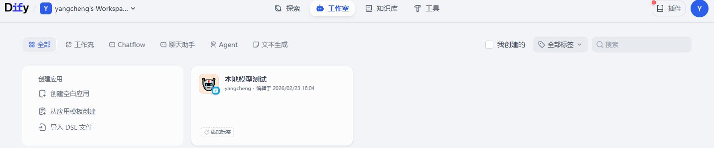
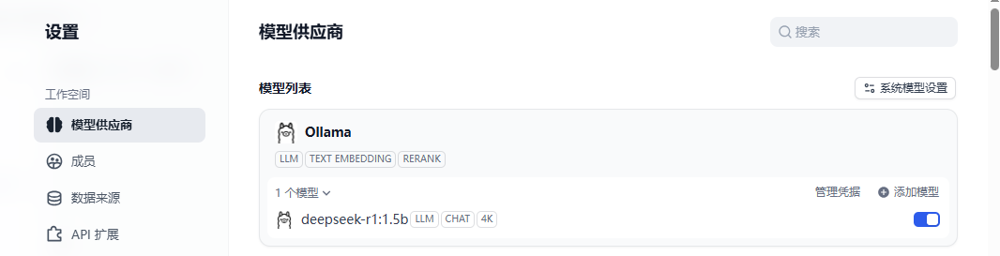
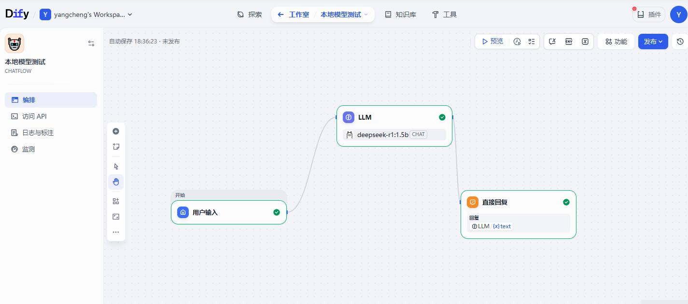

在 Windows 10 上完整部署 Dify 社区版，并接入本地 Ollama 模型（deepseek-r1:1.5b）实现首个 AI 聊天应用的全过程。包含所有踩过的坑、解决方案和最终成果。
📚 目录
背景与目标
环境准备
Docker 安装与配置
Dify 部署
Ollama 集成
创建第一个聊天应用
遇到的坑与解决方案
最终成果
总结与展望

🎯 背景与目标
作为一名对 AI 应用开发感兴趣的技术人员，我希望在本地搭建一套完整的 AI 应用开发环境，既能保护数据隐私，又能灵活调用各种开源模型。选择 Dify + Ollama 组合的原因是：
Dify：开源 LLMOps 平台，可视化编排 AI 应用

Ollama：本地运行大模型的利器，支持多种开源模型

目标：用 1.5B 的小模型跑通完整流程，为后续企业级应用打基础

🔧 环境准备
硬件配置
项目	参数	备注
操作系统	Windows 10 64位	x64 架构
处理器	Intel i3-4150 @ 3.50GHz	双核四线程
内存	8GB DDR3	瓶颈所在
存储	238GB SSD + 466GB HDD	Docker 镜像存 SSD

软件准备
Docker Desktop for Windows
Git（可选，用于克隆代码）
PowerShell（管理员模式）

🐳 Docker 安装与配置
1. 下载 Docker Desktop 
选择正确的版本：根据系统信息中的 x64 架构，下载 Windows – AMD64 版本。
💡 关键点：x64 = AMD64，和 AMD 品牌无关，Intel 处理器也选这个。
2. 开启虚拟化
在 Windows 功能中开启：
Hyper-V
适用于 Linux 的 Windows 子系统 (WSL)
3. 配置国内镜像加速（解决下载慢问题）
在 Docker Desktop 设置 → Docker Engine 中，添加镜像源：
json
{
  "registry-mirrors": [
    "https://docker.nju.edu.cn",
    "https://docker.mirrors.sjtug.sjtu.edu.cn",
    "https://dockerproxy.com",
    "https://hub-mirror.c.163.com"
  ]
}
通过镜像安装不成功，参考《win10本地配置Dify》文档
4. 验证安装
powershell
docker --version
docker version  # 同时看到 Client 和 Server 即成功

🏗️ Dify 部署
1. 下载 Dify 代码
powershell
# 创建工作目录
cd C:\Users\admin
git clone https://github.com/langgenius/dify.git
# 如果没有 git，直接下载 ZIP 解压

2. 进入 Docker 目录并配置
powershell
cd dify\docker
copy .env.example .env

3. 修改超时配置（解决插件安装超时问题）
用记事本打开 .env，在末尾添加：
bash
# 插件安装超时设置
PLUGIN_PYTHON_ENV_INIT_TIMEOUT=360
PLUGIN_MAX_EXECUTION_TIMEOUT=1800
PIP_MIRROR_URL=https://pypi.tuna.tsinghua.edu.cn/simple

4. 启动 Dify
powershell
docker compose up -d
等待所有镜像下载完成（大约 10-15 分钟），看到所有容器状态为 Started 即成功。

5. 访问 Dify
浏览器打开 http://localhost/install，设置管理员账号（邮箱、用户名、密码）。

🤖 Ollama 集成
1. 安装 Ollama
从 ollama.com 下载 Windows 版本，直接安装。

2. 拉取测试模型
powershell
# 拉取轻量级模型用于测试
ollama pull deepseek-r1:1.5b

# 查看已下载的模型
ollama list
# 输出：deepseek-r1:1.5b 1.1GB

3. 在 Dify 中配置 Ollama
进入 Dify → 设置 → 模型供应商 → 找到 Ollama → 点击"添加模型"

关键配置参数：

配置项	值	说明
模型名称	deepseek-r1:1.5b	必须和 ollama list 完全一致
基础 URL	http://host.docker.internal:11434	⚠️ Docker 部署必须用这个
模型类型	对话	
上下文长度	4096	保持默认
💡 为什么用 host.docker.internal？ Dify 跑在 Docker 容器内，容器内的 localhost 指向容器自己，不是 Windows 宿主机。host.docker.internal 是 Docker 提供的特殊域名，用于从容器访问宿主机。

4. 验证配置
保存后，Ollama 卡片下应出现 deepseek-r1:1.5b 模型条目。

💬 创建第一个聊天应用
1. 创建 Chatflow 应用
点击"创建空白应用"
选择 Chatflow
命名"本地模型测试"

2. 配置工作流（关键步骤）
开始节点（默认已有）
负责接收用户输入
LLM 节点配置
点击 LLM 节点
模型选择：deepseek-r1:1.5b
SYSTEM 提示词：你是一个有用的助手，请简单回答用户的问题。
USER 提示词：必须引用用户输入
在 USER 输入框中输入 /
选择 开始节点.sys.query
显示为 {{开始节点.sys.query}}
直接回复节点
连接 LLM 节点的输出

3. 测试对话
点击"预览"
输入：你好，介绍一下你自己
等待模型响应（约 30 秒）

4. 成功！
看到模型输出即代表整个链路跑通。

🕳️ 遇到的坑与解决方案
坑1：Docker Desktop 无限转圈
症状：Settings 界面一直显示"Engine starting"，无法进入。
解决方案：
以管理员身份运行 PowerShell
执行：cd "C:\Program Files\Docker\Docker"
执行：.\DockerCli.exe -SwitchDaemon
重启 Docker Desktop

坑2：镜像拉取失败 - 403 Forbidden
症状：error from registry: 请求过于频繁 或 403 Forbidden
原因：国内镜像源限流，或镜像源中没有特定镜像
解决方案：
更换镜像源（配置多个备选）
手动从 DaoCloud 拉取：
powershell
docker pull docker.m.daocloud.io/langgenius/dify-api:1.13.0
docker tag docker.m.daocloud.io/langgenius/dify-api:1.13.0 langgenius/dify-api:1.13.0

坑3：插件安装超时
症状：通义、Ollama 插件安装失败，提示"Task timed out"
原因：Dify 默认超时时间太短
解决：修改 .env 文件，增加超时配置

🎉 最终成果
成功在本地部署了完整的 AI 应用开发环境：
✅ Docker Desktop 正常运行
✅ Dify 社区版成功部署（访问 http://localhost 可进入）
✅ Ollama 集成完成，本地模型可调用
✅ 第一个 Chatflow 聊天助手正常运行

📝 总结与展望
本次实战收获
掌握 Docker 部署技能：配置 Docker，解决各种网络问题
理解容器网络模型：Docker 容器与宿主机的通信机制
熟悉 Dify 平台：工作流编排、模型配置、变量传递
Ollama 本地模型集成：从拉取模型到在应用中调用
问题排查能力：网络问题、配置问题、变量引用问题的系统排查方法
