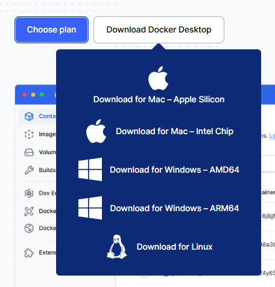

 第一步：安装 Docker Desktop（Dify的运行底座）
 开启虚拟化
 在Windows搜索栏输入“启用或关闭Windows功能”并打开
 找到并勾选 “Hyper-V” 和 “适用于Linux的Windows子系统(WSL)” 。点击确定后，系统会提示你重启电脑。

 下载并安装 Docker Desktop
 https://www.docker.com/products/docker-desktop/
 
根据自己系统下载对应的版本。
安装要点：双击运行安装程序，在配置页面， 
 确保勾选 “Use WSL 2 instead of Hyper-V” 选项，这是为了获得更好的性能 。
 其余一路点击“Next”完成安装。

验证安装
命令行CMD中输入，如果能显示出版本号，就说明Docker安装成功了 。
docker --version

第二步：下载 Dify 安装包，前提是系统里安装了git
git clone https://github.com/langgenius/dify.git

进入目录：代码下载完成后，进入Dify项目中的 docker 文件夹，后续的操作都将在这里进行。
cd dify/docker

 第三步：配置和启动 Dify
这是最核心的一步，我们将用Docker Compose一键启动所有服务。
配置镜像加速（非常重要）
由于网络原因，直接从Docker官方仓库拉取镜像可能会很慢甚至失败。主要是国内限制，访问国外网站很会慢。
这里我失败了很多次，但是还是找到了方法。
从 DaoCloud 镜像源拉取：系统用管理员运行powershell
docker pull docker.m.daocloud.io/langgenius/dify-plugin-daemon:0.5.3-local
重新打标签：
powershell
docker tag docker.m.daocloud.io/langgenius/dify-plugin-daemon:0.5.3-local langgenius/dify-plugin-daemon:0.5.3-local
继续下载其他镜像
# 下载 dify-web
docker pull docker.m.daocloud.io/langgenius/dify-web:1.13.0

# 下载 dify-sandbox
docker pull docker.m.daocloud.io/langgenius/dify-sandbox:0.2.12

# 下载 weaviate（注意拼写是 weaviate）
docker pull docker.m.daocloud.io/semitechnologies/weaviate:1.27.0

# 下载 postgres
docker pull docker.m.daocloud.io/postgres:15-alpine

# 下载 redis
docker pull docker.m.daocloud.io/redis:6-alpine

# 下载 nginx
docker pull docker.m.daocloud.io/nginx:latest

# 下载 squid
docker pull docker.m.daocloud.io/ubuntu/squid:latest

给所有下载的镜像打标签
# 给 dify-api 打标签
docker tag docker.m.daocloud.io/langgenius/dify-api:1.13.0 langgenius/dify-api:1.13.0

# 给 dify-web 打标签
docker tag docker.m.daocloud.io/langgenius/dify-web:1.13.0 langgenius/dify-web:1.13.0

# 给 dify-sandbox 打标签
docker tag docker.m.daocloud.io/langgenius/dify-sandbox:0.2.12 langgenius/dify-sandbox:0.2.12

# 给 weaviate 打标签
docker tag docker.m.daocloud.io/semitechnologies/weaviate:1.27.0 semitechnologies/weaviate:1.27.0

# 给 postgres 打标签
docker tag docker.m.daocloud.io/postgres:15-alpine postgres:15-alpine

# 给 redis 打标签
docker tag docker.m.daocloud.io/redis:6-alpine redis:6-alpine

# 给 nginx 打标签
docker tag docker.m.daocloud.io/nginx:latest nginx:latest

# 给 squid 打标签
docker tag docker.m.daocloud.io/ubuntu/squid:latest ubuntu/squid:latest

验证所有镜像
docker images
你应该能看到每个镜像都有两个版本（一个带 docker.m.daocloud.io，一个不带）。

启动 Dify
powershell
# 现在所有镜像都在本地了，启动！
docker compose up -d

最后一步：访问 Dify
打开你的浏览器，在地址栏输入：

text
http://localhost/install

你应该能看到 Dify 的安装界面！

📝 设置管理员账号
在安装界面上，你需要填写：

邮箱：你的邮箱地址（如 admin@example.com）

用户名：管理员用户名（如 admin）

密码：设置一个密码（如 admin123，建议用复杂点的）

填写完成后点击"安装"或"创建管理员"。

你现在看到的是 Dify 的主界面，这意味着：

✅ Docker 所有服务正常运行

✅ Dify 安装成功

✅ 可以开始创建应用了！

接下来做什么？
第一步：配置模型（必须）
在创建应用之前，需要先配置大模型：

点击右上角头像 → 设置

在左侧菜单选择 模型供应商

选择你想用的模型（比如 DeepSeek、OpenAI、通义千问等）

点击"安装"并输入你的 API Key

💡 小提示：如果你还没有 API Key，可以先试试配置 Ollama（本地开源模型），在模型供应商里搜索 Ollama，按提示配置即可。

第二步：创建第一个应用
现在可以创建你的第一个 AI 应用了：

方案 A：创建知识库问答应用（推荐新手）
点击 创建空白应用
选择 Chatflow
输入应用名称（如"公司知识助手"）
点击创建
在左侧导航点击 知识库，上传一个文档（PDF、TXT 等）
回到应用，在工作流中添加"知识检索"节点，连接刚创建的知识库

方案 B：创建聊天助手
点击 创建空白应用
选择 聊天助手
输入名称，直接开始对话

方案 C：从模板创建
点击 从应用模板创建
浏览社区模板，选择一个直接使用